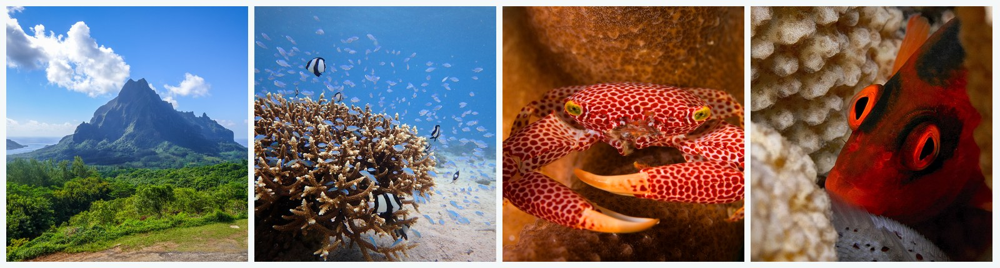

# Habitat amount reshapes coral-associated communities and host condition

[](https://doi.org/10.5281/zenodo.18239646)



**Authors:** Adrian C. Stier, Alexander Primo, Joseph S. Curtis, Craig W. Osenberg

**Repository:** Analysis code and data for a coral-density experiment examining CAFI community assembly and feedbacks to host condition

**Archive:** This repository is permanently archived on Zenodo with concept DOI: [10.5281/zenodo.18239646](https://doi.org/10.5281/zenodo.18239646)

**Status:** Resubmission-ready analysis compendium; run `./run_all.sh` and `make qa` before sharing.

---

## Quick Links

📖 **[Quick Start](#quick-start)** | 📊 **[Key Analyses](#key-analyses-and-files)** | 📚 **[Documentation](docs/)** | 🔬 **[Reproducibility](docs/REPRODUCIBILITY_GUIDE.md)** | 💬 **[Contributing](CONTRIBUTING.md)**

### Highlights

✅ **One-command reproduction** via `./run_all.sh`
✅ **Pre-submission QA** via `make qa`
✅ **Data integrity validation** with checksums
✅ **Pure R analysis workflow** - manuscript assembly lives outside this public analysis repo
✅ **Comprehensive documentation** - reproducibility, data, figure, and QA guides
✅ **Publication-ready figures** - all in `output/MRB/figures/`

---

## Overview

This repository contains all data, code, and outputs for analyzing a field experiment that manipulated coral density (1, 3, or 6 *Pocillopora* colonies per reef) to test how habitat amount affects:

1. Coral-associated fish and invertebrate (CAFI) community assembly
2. Feedbacks between CAFI communities and host condition (growth and physiology)

This public repository is scoped to data analysis, validation, and figure/table generation. Manuscript drafting, Word/PDF production, response-letter assembly, and private coauthor revision materials are maintained in a separate private companion repository that syncs validated outputs from this analysis compendium.

**Key Findings:**
- CAFI abundance increased 5.47× and observed species richness increased 2.82× with increasing coral density
- CAFI community composition shifted with coral density; the Fig. 3 per-colony-density PERMANOVA has a matching non-significant PERMDISP check
- Coral condition (integrated growth + physiology) declined with increasing coral density
- CAFI community composition predicted coral condition
- **Growth finding:** No treatment effect on coral growth after allometric size-correction (*p* = 0.267)

---

## Repository Structure

```
.
├── README.md                           # This file
├── CONTRIBUTING.md                     # Development and contribution guide
├── run_all.sh                          # Master script to run entire analysis
├── Makefile                            # Convenience targets: analysis, quick, qa, validate
├── assets/                             # Static visual assets
│   ├── photos/cafi/                    # CAFI system photos for README/repo materials
│   ├── coral_art/                      # Coral artwork
│   └── silhouettes/                    # Guild silhouettes used in figures
├── docs/                               # Documentation
│   ├── REPRODUCIBILITY_GUIDE.md        # Step-by-step reproduction instructions
│   ├── DATA_AVAILABILITY.md            # Data sharing and access policy
│   ├── DATA_SUBSETTING.md              # Filtering decisions and justification
│   ├── FIGURE_GUIDE_FOR_PUBLICATION.md # Guide to publication figures
│   └── ZERO_INFLATION_PCA_ASSESSMENT.md # PCA validity assessment
├── data/                               # Raw data files
│   ├── checksums.txt                   # MD5 checksums for data integrity
│   └── MRB Amount/
│       ├── 1. mrb_fe_cafi_*.csv        # CAFI community data
│       ├── coral_id_position_*.csv     # Treatment assignments
│       └── ...                         # Coral physiology and growth data
├── scripts/MRB/                        # Analysis scripts (run in order)
│   ├── 1.libraries.R                   # Package loading
│   ├── 3.abundance.R                   # CAFI abundance analysis
│   ├── 4d.diversity.R                  # CAFI diversity metrics
│   ├── 6.coral-growth.R                # Coral growth analysis (MAIN SCRIPT)
│   ├── 7.coral-physiology.R            # Coral physiological metrics
│   ├── 8.coral-caffi.R                 # CAFI-coral relationships
│   ├── 12.nmds_permanova_cafi.R        # Community composition
│   ├── 14.compile-manuscript-statistics.R  # Compile all stats
│   ├── 15.pre_submission_checks.R      # Submission QA ledger and robustness index
│   ├── supplemental_checks/            # Supplemental robustness checks and figures
│   └── validate_pipeline.R             # Validate data integrity and outputs
├── output/MRB/                         # Analysis outputs
│   ├── figures/                        # All generated figures
│   ├── tables/                         # Statistical summary tables
│   └── objects/                        # R session info
```

---

## Quick Start

### Prerequisites

**R version:** 4.3.x or higher

**Required R packages:**
```r
install.packages(c(
  "tidyverse",    # Data manipulation and visualization
  "here",         # File path management
  "lme4",         # Linear mixed-effects models
  "lmerTest",     # p-values for lme4
  "emmeans",      # Post-hoc comparisons
  "vegan",        # Community ecology analyses
  "gt",           # Table formatting
  "patchwork",    # Figure composition
  "cli"           # Console output formatting
))
```

### Running the Analysis

**Option 1: Master Script (Recommended)**

One command to reproduce the entire analysis:

```bash
./run_all.sh
```

For core analyses only (faster):
```bash
./run_all.sh --quick
```

**Option 2: Make targets**

```bash
make analysis   # same as ./run_all.sh
make quick      # same as ./run_all.sh --quick
make qa         # pre-submission QA only
make validate   # data/checksum/output validator
```

**Option 3: Individual Scripts**

Run scripts manually in order:

```bash
Rscript scripts/MRB/1.libraries.R                 # Load packages
Rscript scripts/MRB/3.abundance.R                 # CAFI abundance/scaling
Rscript scripts/MRB/4d.diversity.R                # Diversity, PERMANOVA/PERMDISP, density composition
Rscript scripts/MRB/5.fishes.R                    # Fish community
Rscript scripts/MRB/6.coral-growth.R              # Coral growth (allometric models)
Rscript scripts/MRB/7.coral-physiology.R          # Physiology + integrated performance
Rscript scripts/MRB/12.nmds_permanova_cafi.R      # Community composition checks
Rscript scripts/MRB/8.coral-caffi.R               # CAFI-coral relationships
Rscript scripts/MRB/14.compile-manuscript-statistics.R  # Compile all stats
Rscript scripts/MRB/15.pre_submission_checks.R    # Reviewer/readiness QA
```

**Option 4: Validate Pipeline**

Check data integrity and verify outputs:

```bash
Rscript scripts/MRB/validate_pipeline.R
```

**Expected runtime:** 5-10 minutes (full analysis) | 3-5 minutes (quick mode)

---

## Key Analyses and Files

### 1. Coral Growth Analysis (Script 6)

**File:** `scripts/MRB/6.coral-growth.R`

**What it does:**
- Tests for treatment-specific allometric growth relationships (interaction model)
- Estimates unified allometric exponent for size-correction (*b* = 0.6986)
- Tests treatment effect on size-corrected growth
- Generates 3-panel growth figure

**Key outputs:**
- `output/MRB/figures/coral/ANCOVA_Init_vs_Final_Volume_by_Treatment.png`
- `output/MRB/figures/coral/ANCOVA_TreatmentSpecific_Slopes.png`
- `output/MRB/figures/coral/SizeCorrected_Volume_Growth_by_Treatment.png`

**Key results:**
- Interaction: χ² = 6.48, *p* = 0.039 (treatment-specific slopes differ)
- Treatment-specific slopes: *b* = 0.78 (1 colony), -0.10 (3 colonies), 1.00 (6 colonies)
- Post-hoc comparisons: all *p* > 0.07 (no pairwise differences)
- Interaction-vs-parallel model comparison: χ² = 5.23, *p* = 0.073
- **Main finding:** No treatment effect on size-corrected growth (χ² = 2.64, *p* = 0.267)

### 2. Coral Physiology (Script 7)

**File:** `scripts/MRB/7.coral-physiology.R`

**What it does:**
- Analyzes carbohydrate, protein, Symbiodiniaceae density, AFDW by treatment
- Creates integrated performance PC1 (physiology + growth)
- Multiple testing correction (Benjamini-Hochberg)

**Key results:**
- Carbohydrate: χ² = 10.0, *p* = 0.007 (BH-adjusted *p* = 0.039)
- PC1 (condition): χ² = 8.11, *p* = 0.017
- Individual metrics (protein, Symbiodiniaceae density, AFDW): NS

### 3. CAFI-Coral Relationships (Script 8)

**File:** `scripts/MRB/8.coral-caffi.R`

**What it does:**
- Tests whether CAFI community composition predicts coral condition
- Uses multiple data transformations for robustness
- Creates CAFI community PCA and coral condition PCA

**Key results:**
- SQRT_CS transformation: beta = 0.301, *p* = 0.014
- HELLINGER transformation: beta = 0.311, *p* = 0.008
- SQRT transformation: beta = 0.179, *p* = 0.153
- The community-condition relationship is supported by the centered/scaled square-root and Hellinger transformations; the square-root-only check is directionally similar but not significant.

### 4. Community Composition QA (Script 4d + Script 15)

**Files:** `scripts/MRB/4d.diversity.R`, `scripts/MRB/15.pre_submission_checks.R`

**Key outputs:**
- `output/MRB/tables/16_permanova_summary.csv`
- `output/MRB/tables/16_permdisp_summary.csv`
- `output/MRB/tables/16_species_density_drivers_top15.csv`
- `output/MRB/tables/composition_robustness_index.csv`
- `output/MRB/tables/pre_submission_qa_summary.md`

**Key results:**
- Reef per-colony-density PERMANOVA: *F* = 2.013, R² = 0.168, *p* = 0.015
- Matching PERMDISP: *F* = 2.275, *p* = 0.122
- Pre-submission QA currently passes with warnings only for future structural gates (`claims.tsv`, `display_items.tsv`, `renv.lock`)

### 5. Statistical Compilation (Script 14)

**File:** `scripts/MRB/14.compile-manuscript-statistics.R`

**What it does:**
- Compiles all statistical tests from Scripts 6-8
- Creates human-readable HTML table
- Generates CSV for easy import

**Key outputs:**
- `output/MRB/tables/MANUSCRIPT_STATISTICAL_TESTS.csv`
- `output/MRB/tables/MANUSCRIPT_STATISTICAL_TESTS.html`
- `output/MRB/MANUSCRIPT_STATS_TABLE.csv`

---

## Data Files

### Coral Growth Data
**Location:** `data/MRB Amount/`

**Files:**
- Individual coral volume/surface area measurements from 3D photogrammetry
- Initial (2019) and final (2021) measurements
- Tissue mortality assessments

**Sample size:** *n* = 44 corals (≥80% tissue alive)

### CAFI Community Data
**Location:** `data/MRB Amount/`

**Files:**
- Species-level abundance data for all CAFI taxa
- Taxonomic identifications

**Sample size:** 23 reef units after the ≥80% live-tissue filter (14 one-coral, 6 three-coral, 3 six-coral)

### Coral Physiology Data
**Location:** `data/MRB Amount/`

**Files:**
- Carbohydrate content (mg/cm²)
- Protein content (mg/cm²)
- Symbiodiniaceae density (cells/cm²)
- Ash-free dry mass (AFDM, mg/cm²)

---

## Key Statistical Approaches

### Allometric Growth Model

We used a **unified allometric model** approach (Osenberg, pers. comm.) to handle size-dependent growth:

1. **Test for interaction:** `log(V_final) ~ log(V_initial) × treatment + (1|reef)`
   - Significant interaction (*p* = 0.039) indicated treatment-specific slopes
   - However, no pairwise differences after Tukey adjustment (all *p* > 0.07)
   - Interaction-vs-parallel model comparison was marginal (*p* = 0.073), supporting the unified exponent used below

2. **Estimate unified exponent:** `log(V_final) ~ log(V_initial) + treatment + (1|reef)`
   - Unified *b* = 0.6986 (more precise than treatment-specific estimates)
   - Used for all size-corrections: `growth_vol_b = V_final / V_initial^0.6986`

3. **Test treatment effect:** Size-corrected growth ~ treatment + (1|reef)
   - Result: *p* = 0.267 (NS)

**Rationale:** Balances evidence for treatment-specific slopes against need for robust, comparable growth metric given high uncertainty in some slope estimates (SE = 0.38 for 3-colony treatment).

### Linear Mixed-Effects Models

All models used `lme4::lmer()` with:
- **Random effects:** Reef as random intercept (accounts for spatial structure)
- **Estimation:** REML for final models, ML for likelihood ratio tests
- **Inference:** Type III Wald χ² tests (lmerTest package)

### Multiple Testing Correction

Benjamini-Hochberg procedure for physiology metrics (Script 7)

---

## Reproducibility Notes

### Data Filtering

**Coral growth:** Only colonies with ≥80% tissue alive retained (*n* = 44 of 54)

**Rationale:** Partially dead colonies exhibit altered growth patterns

### Software Versions

- R 4.3.x
- lme4 1.1-35.x
- lmerTest 3.1-3
- emmeans 1.10.0
- vegan 2.6-x
- tidyverse 2.0.0

### Random Effects Structure

All models include `(1|reef)` random intercept to account for:
- Spatial clustering (reefs arranged in 9×3 grid)
- Shared environmental conditions within reef
- Non-independence of colonies on same reef

### Known Issues

None currently. All scripts run successfully with provided data.

---

## Output Files for Paper Integration

### Main Statistics
- `output/MRB/MANUSCRIPT_STATS_TABLE.csv` - Complete statistical results table
- `output/MRB/KEY_STATISTICS_FOR_MANUSCRIPT.md` - Quick reference with copy-paste ready text

### Figures
- `output/MRB/figures/publication-figures/` - All publication-quality figures
  - Growth figures (3-panel: interaction, slopes, size-corrected)
  - Physiology figures
  - CAFI-coral relationship figures

### Tables
- `output/MRB/tables/MANUSCRIPT_STATISTICAL_TESTS.csv` - All statistical tests
- `output/MRB/tables/MANUSCRIPT_STATISTICAL_TESTS.html` - Formatted HTML table

---

## Citation

If you use this code or data, please cite:

**Manuscript:**
```
Stier, A.C., Primo, A., Curtis, J.S., & Osenberg, C.W. (2026). Habitat amount
reshapes coral-associated communities and host condition. Ecology Letters.
DOI: [to be added upon publication]
```

**Data & Code Archive:**
```
Stier, A.C. (2026). adrianstier/coral-cafi-density-experiment: v1.0.3 -
Final Resubmission Snapshot [Software]. Zenodo.
https://doi.org/10.5281/zenodo.21727277

All-version concept DOI: https://doi.org/10.5281/zenodo.18239646
```

---

## Contributing

We welcome contributions! See [CONTRIBUTING.md](CONTRIBUTING.md) for guidelines on:
- Reporting issues or bugs
- Suggesting improvements
- Reproducing and verifying results
- Adding new analyses

---

## Contact

**Corresponding Author:** Adrian C. Stier
- 📧 Email: astier@ucsb.edu
- 🔬 Affiliation: UC Santa Barbara, Dept. of Ecology, Evolution, and Marine Biology

**Issues & Questions:**
- Code/reproducibility: [Open an issue](https://github.com/adrianstier/coral-cafi-density-experiment/issues)
- Data access: See [DATA_AVAILABILITY.md](docs/DATA_AVAILABILITY.md)

---

## License

- **Code:** MIT License
- **Data:** [CC-BY 4.0](https://creativecommons.org/licenses/by/4.0/) (Creative Commons Attribution 4.0 International)

---

## Acknowledgments

- Craig W. Osenberg for statistical consultation on unified allometric model approach
- Moorea Coral Reef LTER for field site access and support
- French Polynesian government for research permits

---

<div align="center">

**Last Updated:** July 31, 2026
**Repository Version:** v1.0.3 final resubmission snapshot
**Status:** Reviewer-readiness QA passed with WARN-only optional future gates

[](https://doi.org/10.5281/zenodo.18239646)

</div>
